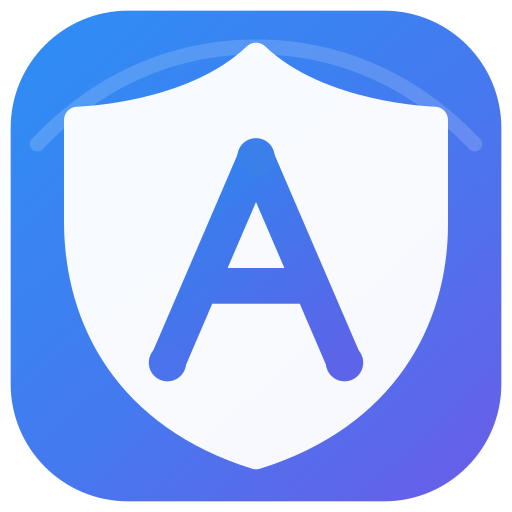

<p align="center">
  
</p>

<h1 align="center">Aegos</h1>

<p align="center">
  面向 Windows 的桌面代理控制、状态观测与故障恢复工具
</p>

Aegos 是一款使用 Tauri、Rust 和 WebView2 构建的 Windows 桌面代理客户端。
它负责用户配置、连接流程、Windows 网络接管、状态验证、诊断和恢复；
[Mihomo](https://github.com/MetaCubeX/mihomo) 作为受管数据平面，负责代理协议、
DNS、TUN、流量转发与规则执行。

Aegos 的目标不是把核心配置文件原样暴露给用户，而是把“导入订阅、选择节点、
连接、观察、切换、断开和修复”组织成可验证、可恢复的桌面工作流。

> [!IMPORTANT]
> Aegos 当前仍处于持续开发和本地验证阶段。仓库中的构建产物、候选版本或测试
> 证据不等同于已签名的正式发行版。当前没有自动更新通道；请以 GitHub Releases
> 页面和对应版本说明中实际存在的内容为准。

## 为什么开发 Aegos

很多代理客户端容易把几个不同事实混在一起：核心进程已经启动、节点测速成功、
系统代理已经接管、TUN 已生效、出口 IP 已改变。它们并不等价。Aegos 将这些状态
分开验证，并只在运行时、Windows 接管和连通性事实相互支持时显示“已连接”。

Aegos 主要解决以下问题：

- 不要求普通用户直接编辑 Mihomo YAML 或操作 Controller API。
- 将连接、切换、断开等高风险操作做成带预检、验证和回滚的事务。
- 在网络请求缓慢、失败或被中断时，仍然保留导航、状态中心和诊断能力。
- 明确区分“用户设置的意图”和“当前已经生效的状态”。
- 测速只负责测量，不自动连接、切换节点或修改系统网络。
- 出现系统代理、TUN、DNS、IPv6 或防火墙问题时，提供可操作的诊断与恢复信息。

## 适用人群

- 希望在 Windows 上导入订阅、选择节点并完成日常连接的用户。
- 需要固定节点、固定出口、上游代理或更明确分流控制的用户。
- 需要确认当前出口 IP、DNS、IPv6、TUN 和系统代理实际状态的用户。
- 希望发生失败后能够看到原因、恢复网络，而不是只得到“操作失败”的用户。

当前支持范围为 **Windows 10/11 x64**。暂不支持 Windows ARM64、macOS、Linux、
云端控制或多用户协作。

## 主要功能

### 订阅与节点

- 导入、更新、切换和删除订阅。
- 过滤订阅中的流量、到期时间等伪节点信息。
- 管理普通节点、收藏节点和持久化固定节点。
- 支持固定节点凭据、链式出口和受控的上游代理场景。
- 节点切换包含预检、运行时验证和失败回滚。

### 连接与 Windows 接管

- 后台执行连接、断开、重启和节点切换，避免阻塞界面。
- 支持 Windows 系统代理和 TUN 两种接管方式。
- 支持断网保护，并验证实际防火墙状态。
- 接管前保存恢复信息，失败或中断后可以修复系统代理状态。
- 区分选择节点、核心实际运行节点和当前出口，避免展示过期成功状态。

### 节点测速

- 批量测速和单节点测速均在后台执行。
- 测速过程中逐项显示结果，不等待整个批次完成。
- 首个真实结果返回前显示明确的等待进度，不使用伪造延迟值。
- 失败结果提供超时、DNS、TLS、认证等结构化原因。
- **测速不会连接、切换节点，也不会修改系统代理、TUN、路由或防火墙。**

### 路由与配置

- 提供面向用户的网站、应用和系统规则管理。
- 支持规则预览、冲突说明、应用前检查和应用后验证。
- 高级配置扩展具有受保护字段、行级错误、意图预览和事务回滚。
- UI 不读取 Controller secret，也不直接解析或写入运行时 YAML。

### 状态与诊断

- 展示节点、延迟、稳定性、活动连接、上传和下载等运行信息。
- 分别呈现系统代理、TUN、DNS、IPv6、出口 IP 和断网保护状态。
- 诊断页提供分类问题、严重程度、建议动作和修复入口。
- 日志支持分类、筛选、复制和脱敏导出。
- 状态中心在后台任务执行期间仍可使用。

### 本机备份

- 使用 Windows 当前用户的 DPAPI 创建本机加密备份。
- 可备份设置、订阅配置和用户分流规则。
- 恢复操作要求 Aegos 处于断开状态。
- 备份不进行云上传、WebDAV 同步或远程传输。

## 基本使用流程

1. 打开“订阅”，导入订阅链接或本地 Clash/Mihomo 配置。
2. 在“节点”中选择节点；需要时可先执行测速。
3. 在首页选择系统代理或 TUN 等接管方式。
4. 点击连接，等待 Aegos 完成配置部署、核心启动和接管验证。
5. 通过首页、状态中心或诊断页确认实际节点、出口和保护状态。
6. 切换节点或断开；如果接管未恢复，可使用诊断与修复功能。

部分功能需要管理员权限：

- 普通系统代理通常可以在标准用户权限下使用。
- TUN、断网保护以及部分系统修复功能需要管理员权限。
- Aegos 会在需要时提示以管理员身份重新启动，而不是默认要求永久提权。

## 状态真实性

Aegos 将下列信息视为不同层级的事实：

| 信息 | 含义 |
| --- | --- |
| 已保存设置 | 用户希望使用的配置，不代表已经生效 |
| 核心状态 | 受管 Mihomo 是否按 Aegos 期望运行 |
| 接管状态 | Windows 系统代理、TUN 或防火墙是否实际生效 |
| 连通事实 | 当前路径是否能够完成真实连接或出口观测 |
| 已连接 | 只有上述必要事实一致时才会显示 |

慢速观测结果带有代际和路由身份检查，旧请求不能覆盖较新的节点、订阅或连接状态。

## 系统架构

```text
WebView2 用户界面
  -> Tauri 产品命令
    -> Aegos 控制平面与后台任务
      -> 配置编译、预检、部署与回滚
      -> Windows 系统代理 / TUN / 防火墙接管
      -> 受限的 Mihomo 适配层
        -> 代理协议、DNS、TUN、转发与规则执行
```

核心边界：

- Aegos 是产品控制平面，拥有产品状态和 Windows 操作流程。
- Mihomo 是受管数据平面；Aegos 不重新实现代理协议或第二套规则引擎。
- 前端只接收 Aegos 规范化后的产品状态，不直接访问 Controller secret。
- 改变网络的操作在后台执行，并通过运行事实验证最终结果。

更详细的模块说明见 [架构文档](docs/architecture.md)。

## 从源码运行

### 环境要求

- Windows 10/11 x64
- Node.js 与 npm
- Rust stable，目标为 `x86_64-pc-windows-msvc`
- Visual Studio C++ Build Tools
- Microsoft Edge WebView2 Runtime

### 安装依赖并检查

```powershell
git clone https://github.com/JoyceBrown/Aegos.git
cd Aegos
npm install
npm run check
```

### 启动开发版本

```powershell
npm run dev
```

开发运行会启动桌面应用。测试网络接管功能前，请确认本机没有其他软件占用相同
端口或同时控制系统代理、TUN 和防火墙。

### 构建 NSIS 安装包

```powershell
npm run build
```

默认输出目录：

```text
src-tauri/target/release/bundle/nsis/
```

本地构建默认不包含可信发布所需的 Authenticode 签名。不要把未签名的本地候选包
误认为正式发布版本。

## 验证与测试

Aegos 不以“成功编译”作为完成标准。仓库包含 Rust、交互、UI、性能、稳定性、
安全、架构和安装包等多层检查。

常用命令：

```powershell
# Rust 检查与测试
npm run check
cargo test --manifest-path src-tauri/Cargo.toml

# 产品交互和固定窗口/DPI UI 检查
npm run smoke:interactions
npm run smoke:ui

# 大节点量、快速导航和长时间运行检查
npm run smoke:perf:stress
npm run smoke:soak

# 后端、响应性、安全和架构边界
npm run audit:backend
npm run audit:responsiveness
npm run audit:security
npm run audit:control-plane
npm run audit:architecture

# 安装包与发布结构
npm run audit:installer
npm run audit:release
```

不同修改需要运行与风险相匹配的检查。完整候选版本还需要通过仓库计划规定的
Windows 验收矩阵，不能通过删除断言、降低预算或跳过失败来获得绿色结果。

## 项目目录

| 路径 | 内容 |
| --- | --- |
| `src/` | WebView2 前端、页面和用户工作流 |
| `src-tauri/src/` | Rust 控制平面、配置事务、诊断和 Windows 接管 |
| `resources/core/` | 受管 Mihomo 运行资源 |
| `tools/` | 产品、UI、性能、安全、架构和交付审计工具 |
| `docs/` | 产品、架构、设计、路线和历史证据 |
| `PLANS.md` | 有活动任务时唯一可执行的仓库计划 |

文档导航见 [docs/INDEX.md](docs/INDEX.md)。产品范围和非目标见
[docs/product.md](docs/product.md)。长期方向见 [docs/roadmap.md](docs/roadmap.md)。

## 隐私与安全

- 订阅 URL、token、节点凭据、私钥和 Controller secret 不应出现在提交中。
- UI、日志、测试 fixture、截图和导出报告必须对敏感值脱敏。
- 动态用户文本和核心文本使用安全文本节点渲染，避免 HTML 注入。
- 配置与网络变更必须经过预检、应用、验证；失败时执行回滚或保留恢复证据。
- Aegos 的本机备份不依赖远程服务，也不包含自动同步功能。
- 仓库保留所使用第三方组件的许可证；不要复制其他 GPL 项目的代码、图标或 UI
  资产来实现功能。

## 当前限制与非目标

- 仅支持 Windows 10/11 x64。
- 当前没有 Authenticode 签名、自动更新或公共发布自动化。
- 不提供 WebDAV、云同步、远程备份或远程脚本执行。
- 不计划内置第二个代理核心，也不提供无边界的原始核心配置编辑器。
- 不以功能数量代替可靠性；现有导入、连接、切换、断开和恢复流程优先。
- 自动化测试不能证明所有真实 Windows 网络环境；实际问题仍需要可复现证据。

## Aegos 与 Mihomo

Aegos 会随应用管理经过批准的 Mihomo 运行资源，但两者职责不同：

- Aegos 负责桌面产品体验、状态模型、配置事务、Windows 接管和恢复。
- Mihomo 负责协议实现、DNS、TUN、流量转发和规则执行。
- Aegos 可以研究 Mihomo 的公开契约与行为，但不会把 Mihomo 扩展成第二套产品
  控制平面，也不会复制其他客户端的 UI 资产。

使用、修改或再分发时，请同时遵守仓库中各第三方组件对应的许可证要求。
